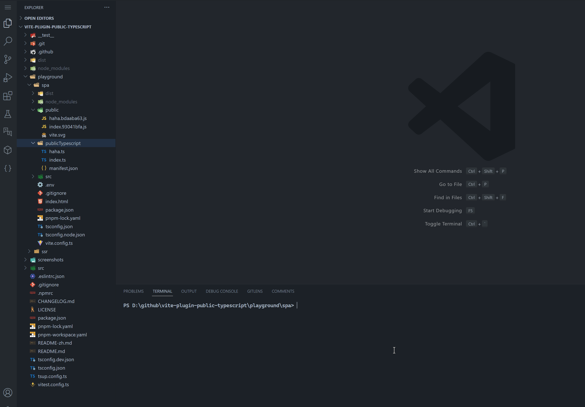

# vite-plugin-public-typescript

> This is useful for SSR ✨

## Features

- transform public typescript to public javascript
- output js with hash

## Install

```bash
pnpm add vite-plugin-public-typescript -D
```

or

```bash
npm i vite-plugin-public-typescript -D
```

## Preview



## Usage

```ts
import { defineConfig } from 'vite'
import { publicTypescript } from 'vite-plugin-public-typescript'

export default defineConfig({
  plugins: [
    publicTypescript({
      inputDir: 'publicTypescript',
      outputDir: 'lib',
      manifestName: 'manifest',
      hash: true,
    }),
  ],
})
```

```ts
import manifest from './path/to/publicTypescript/manifest.json'

manifest[yourFileName] // get js fileName! use it anywhere
```

## Options

| Parameter      | Types          | Default            | Description                                           |
| -------------- | -------------- | ------------------ | ----------------------------------------------------- |
| ssrBuild       | `boolean`      | `true`             | whether is ssrBuild                                   |
| inputDir       | `string`       | `publicTypescript` | input public typescript dir                           |
| outputDir      | `string`       | `/`                | output public javascript dir, relative to `publicDir` |
| manifestName   | `string`       | `manifest`         | js manifest fileName                                  |
| hash           | `boolean`      | `true`             | whether generate js fileName with hash                |
| esbuildOptions | `BuildOptions` | `{}`               | esbuild BuildOptions                                  |

## Example project

[vite-react-ssr-boilerplate](https://github.com/hemengke1997/vite-react-ssr-boilerplate)

## License

MIT

[npm-img]: https://img.shields.io/npm/v/vite-plugin-public-typescript.svg
